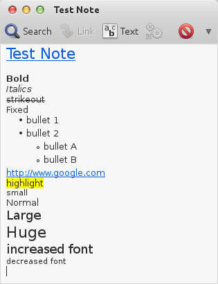
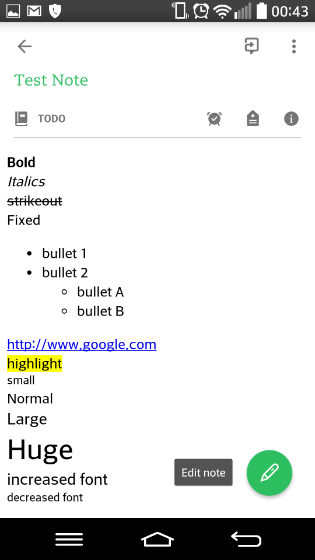

# Tomboy2Evernote
Exports Tomboy Notes to Evernote Format





# Usage
```bash
python Tomboy2Evernote.py -i ~/.local/share/tomboy -o ~/Desktop
```

# Requirements
Python 2.7

# Tested on ubuntu 14.04
